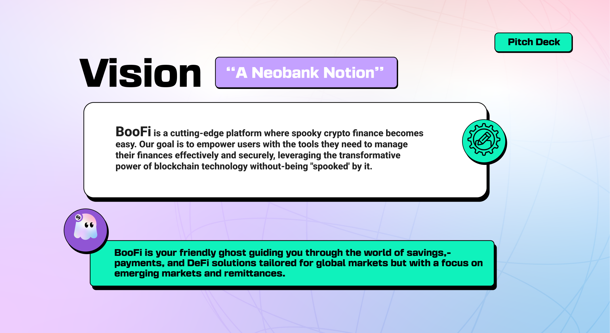
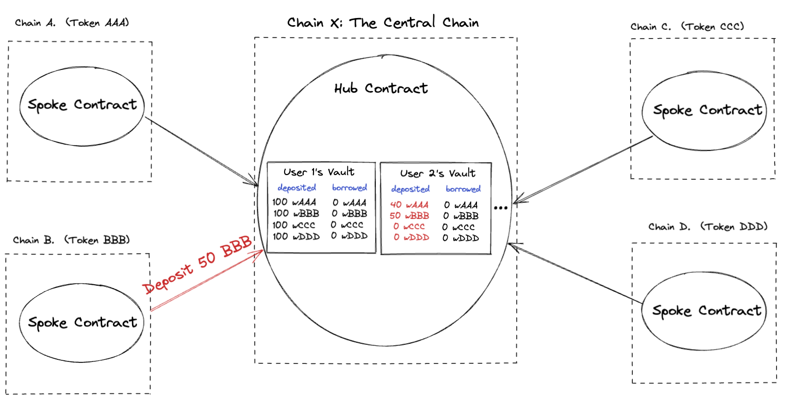

# Bu Finance: Stablecoin-first Multichain DeFi and Open Banking for Emerging Markets with AI

## 🌐 Overview

By leveraging a **Hub and Spoke Money Market** model, Bu Finance facilitates secure borrowing and lending, enabling seamless cross-border transactions and liquidity management across multiple blockchain networks with a private blockchain for open banking services in LATAM looking to create a spoke with the coming of regional CBDCs and stablecoins in the region.

## 🛠 Architecture

### **Technical Stack**

- **Blockchain Protocols:** Avalanche, Bsc, CCIP, Wormhole
- **AI Integration:** OpenAI Realtime API
- **Frontend:** Next.js 14, TailwindCSS, Shadcn UI components
- **Liquidator:** Rust flash-loan liquidator for over collateralized loan liquidation with AAVE and Uniswap liquidity.
- **AI Voice Relayer:** AI voice relayer connected to OpenAi's Realtime API for voice assistance.
- **Backend:** Node.js, Supabase

## 📝 Deployed Contracts

### **Production Addresses**

| Network   | Contract Type | Address                                      |
| --------- | ------------- | -------------------------------------------- |
| BSC       | Spoke         | `0x2A97438Acf6f1c0745171C8DA7e199F5061a0C3b` |
| Avalanche | Hub           | `0x6958d698e0399C82e9e9f32f0cfEE48cE5952DF3` |

### **Contract Verification**

- [BSC Spoke Contract on BscScan](https://testnet.bscscan.com/address/0x2A97438Acf6f1c0745171C8DA7e199F5061a0C3b)
- [Avalanche Hub Contract on SnowTrace](https://testnet.snowtrace.io/address/0x6958d698e0399C82e9e9f32f0cfEE48cE5952DF3)

## 🔧 Getting Started

### **Prerequisites**

- **Node.js:** Version 20.x or later
- **Package Manager:** bun

## 🧩 Technical Details

### **Hub and Spoke Money Market Model**

Buemploys a **Hub and Spoke** architecture to manage liquidity and consensus across multiple blockchains:

- **Central Hub:** Acts as the liquidity aggregator and consensus finalizer, deployed on a scalable L1 blockchain.
- **Spokes:** Connect various L1 and L2 blockchains, pulling liquidity into the central hub using CCIP and Wormhole protocols.
- **Private Blockchain Integration:** Links to a dedicated Open Banking L1, enabling secure DeFi access for LATAM fintech and incorporation of CBDCs.

### **BuAI Console**

The AI Console enhances user experience through intelligent assistance:

- **Real-Time API Integration:** Utilizes OpenAI’s Realtime API to provide instant insights and management tools.
- **Smart Wallet Management:** Assists users in managing Coinbase smart wallets, offering tailored financial advice and automated transactions.

### **Payments & Bridge**

BooFi’s payment and bridging solutions ensure seamless and secure transactions:

- **ENS-Based Payments:** Simplifies USDC transactions using `ens.names` via Wormhole.
- **QR Code Art Generator:** Enhances payment link sharing with customizable QR codes.
- **Peanut Protocol Integration:** Facilitates easy USDC payments through shareable links.
- **CCIP Bridge:** Ensures reliable USDC transfers across different blockchain ecosystems.
