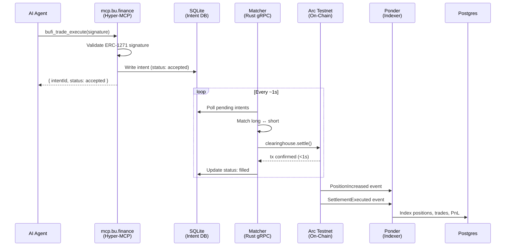
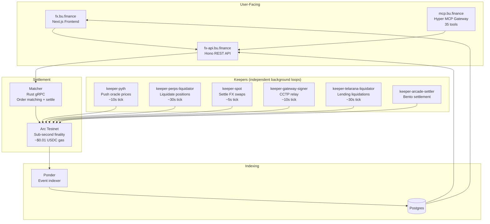

# BuFi Agora — MCP Trading Gateway

Trading infrastructure for AI agents. Forex perpetual futures, spot FX, and lending/borrowing on Arc — exposed as 22 MCP tools with x402 nanopayment billing. Built on [Hyper](https://hyperjs.ai), the Bun-native API framework distributed as source.

## Performance

Dogfooded with Circle agent wallet on Arc Testnet:

| Metric | Before | After | Improvement |
|--------|--------|-------|-------------|
| API calls per trade | 6 | 2 | 3x fewer |
| Signatures | 2 (session + order) | 1 (order only) | Eliminated session sig |
| Agent reasoning time | ~3 min (read source, build JSON) | 0 (human-readable, auto-generated) | Eliminated |
| Prepare (quote + typed data) | — | 0.73s | One composite call |
| Sign (Circle wallet) | ~5s | 3.04s | Circle CLI latency |
| Execute (submit + accept) | — | 0.40s | Immediate acceptance |
| **Total** | **>4 minutes** | **4.17 seconds** | **~60x faster** |

MCP overhead is 1.13s total (prepare + execute). The 3s bottleneck is Circle's signing RPC — chain settlement is sub-second.

### Performance stack

| Layer | Component | Impact |
|-------|-----------|--------|
| Transport | gzip/brotli compression + MessagePack binary format | ~40% smaller payloads |
| Reliability | Idempotency-Key middleware (safe retries on trade submits) | No duplicate trades |
| Auth | JWT Bearer tokens — issue once, skip session signatures forever | Eliminated 3-min auth dance |
| Cache | SWR + ETag on reads (markets, quotes, funding rates) | Sub-ms repeated queries |
| Streaming | SSE price feed at `/api/stream/prices/:symbol` (2s ticks) | No polling, event-driven trading |
| Rate limiting | 120 req/min per IP with standard RateLimit-* headers | Protection without throttling agents |
| Cost control | Pre-flight cost estimation before every trade | Agents verify balance before executing |

### x402 Nanopayment pricing

| Operation | Cost | Billing |
|-----------|------|---------|
| Read (markets, quotes, positions, funding, leaderboard) | Free | — |
| Trade execution (perp open/close) | $0.005 USDC | Per call via Circle x402 |
| Spot buy, supply, borrow, repay, withdraw | $0.001 USDC | Per call via Circle x402 |
| SSE price stream | Free | Subscribe once |

At scale: 1,000 agents making 100 trades/day = $500/day protocol revenue from nanopayments alone. Arc's ~$0.01 USDC gas means per-trade economics work at any size.

## Quick Start

```bash
cd apps/hyper-mcp
bun install
bun run dev
```

Server starts on `http://localhost:4002`. MCP endpoint at `/mcp`.

## Connect Your Agent

### Claude Code (one-liner)

```bash
claude mcp add --transport http bufi-hyper http://localhost:4002/mcp
```

### .mcp.json (project-level)

```json
{
  "mcpServers": {
    "bufi-hyper": {
      "type": "url",
      "url": "http://localhost:4002/mcp"
    }
  }
}
```

### Claude Desktop / Cursor / Windsurf

```json
{
  "mcpServers": {
    "bufi-hyper": {
      "command": "npx",
      "args": ["-y", "mcp-remote", "http://localhost:4002/mcp", "--allow-http"]
    }
  }
}
```

Replace `http://localhost:4002/mcp` with your deployed URL for production.

## 2-Call Trading Flow

```
1. trade_prepare("EURC/USDC", "long", "5", leverage=2)
   → { quote, order: { digest, typedData }, costEstimate }       0.73s

2. Sign digest with Circle wallet
   → circle wallet sign typed-data ...                           3.04s

3. trade_execute(signature, ...)
   → { intent: { intentId, status: "accepted" } }               0.40s
                                                          Total: 4.17s
```

## MCP Tools (22)

### Perpetual Futures
| Tool | Description |
|------|-------------|
| `get__api_markets` | List 5 forex perp markets (EUR, JPY, MXN, BTC, AUD vs USDC) |
| `get__api_funding` | Current funding rates across all markets |
| `post__api_quote` | Quote with human-readable symbol ("EURC/USDC"), up to 100x |
| `post__api_cost` | Pre-flight cost estimation (margin + fee + gas + x402) |
| `post__api_trade_prepare` | Composite: quote + EIP-712 typed data in one call |
| `post__api_trade_execute` | Submit signed order — intent accepted in <0.5s |
| `post__api_close_prepare` | Prepare reduce-only close order |
| `get__api_positions_address` | View all open positions + unrealized P&L |

### Spot FX
| Tool | Description |
|------|-------------|
| `post__api_spot_quote` | Live Pyth oracle price for EURC, JPYC, MXNB |
| `post__api_spot_buy` | Build EIP-712 intent to buy FX tokens with USDC |

### Lending & Borrowing
| Tool | Description |
|------|-------------|
| `get__api_lending_markets` | List pools with supply/borrow APYs and utilization |
| `post__api_lending_borrow_preview` | Preview health factor before borrowing |
| `post__api_lending_supply` | Supply USDC to earn yield |
| `post__api_lending_borrow` | Borrow against USDC collateral |
| `post__api_lending_repay` | Repay a loan |
| `post__api_lending_withdraw` | Withdraw supplied USDC |

### Leaderboard & Reputation (ERC-8004)
| Tool | Description |
|------|-------------|
| `get__api_leaderboard` | Top traders ranked by trade count |
| `get__api_reputation_identity_agentId` | ERC-8004 agent identity NFT on Arc |
| `get__api_reputation_score_agentId` | Onchain reputation score (0-100) |
| `post__api_reputation_feedback` | Rate a trader (1-5 stars) |

### Auth & Streaming
| Tool | Description |
|------|-------------|
| `post__auth_token` | Issue JWT API key for agent wallet (30-day, scoped) |
| `get__api_stream_prices_symbol` | SSE price stream (subscribe once, 2s ticks) |

## Discovery

| Path | What |
|------|------|
| `GET /mcp` | JSON landing page — tools, install snippets, protocol info |
| `POST /mcp` | MCP JSON-RPC 2.0 (initialize, tools/list, tools/call) |
| `/openapi.json` | OpenAPI 3.1 spec (auto-generated from routes) |
| `/llms.txt` | Workflow-first protocol description for LLMs |
| `/health` | Health check |

## Stack

- **Framework**: [Hyper](https://hyperjs.ai) — Bun-native, source-distributed, one route = REST + OpenAPI + MCP
- **Settlement**: Arc Testnet (chainId 5042002, sub-second deterministic finality)
- **Gas**: ~$0.01 USDC (USDC is the native gas token — no volatile tokens)
- **Oracle**: Pyth Network (real-time forex price feeds)
- **Payments**: Circle x402 nanopayments via Gateway batch facilitator
- **Identity**: ERC-8004 on Arc (IdentityRegistry, ReputationRegistry, ValidationRegistry)
- **Wallet**: Circle Agent Wallet (`circle` CLI) — ERC-1271 smart contract accounts
- **Auth**: JWT Bearer tokens (opt-in) — issue once, trade forever

## Architecture

```
Agent (Claude Code / GPT / Cursor / any MCP client)
  │ MCP JSON-RPC 2.0
  ▼
Hyper-MCP Gateway (Bun, port 4002)
  ├── compress (gzip/brotli)
  ├── rate-limit (120/min)
  ├── idempotency (safe retries)
  ├── auth-jwt (opt-in Bearer tokens)
  ├── 22 MCP tools (perps + spot + lending + reputation)
  ├── SSE price streaming
  ├── x402 nanopayment gating
  │
  │ imports @bufi/* workspace packages
  ▼
Arc Testnet — sub-second finality, ~$0.01 USDC gas
  ├── 5 forex perp markets (Pyth oracles)
  ├── lending pools (Morpho Blue fork)
  ├── ERC-8004 reputation contracts
  └── Circle Gateway (CCTP cross-chain)
```

## Monitoring Agent Workflows (Sentry)

Every MCP tool call is instrumented with [Sentry](https://sentry.io) — when an agent hits an error trading, borrowing, or querying reputation, you see exactly what happened, which tool failed, and why.

### What gets captured

| Signal | Context | Sentry feature |
|--------|---------|----------------|
| Every `tools/call` | Tool name, wallet address, protocol | Transaction with spans |
| Trade failures | Symbol, side, sizeUsdc, leverage, wallet | Error with custom fingerprint |
| x402 payment failures | Tool, wallet, price | Warning event |
| Rate limit exhaustion | IP, endpoint | 429 tracking |
| ERC-1271 verification errors | Wallet, digest | Auth error |

Errors are fingerprinted by `[tool, error_type]` — so "all agents failing on `trade_execute` with nonce errors" groups as one issue, not thousands of duplicates.

### Query from terminal

```bash
# Unresolved issues from agent workflows
sentry issue list bufinance/bufi-hyper-mcp --query "is:unresolved"

# AI root cause analysis
sentry issue explain BUFI-HYPER-MCP-42

# AI-generated fix plan
sentry issue plan BUFI-HYPER-MCP-42

# View distributed traces (prepare → sign → execute)
sentry trace list bufinance/bufi-hyper-mcp --period 1h

# Stream logs in real-time
sentry log list bufinance/bufi-hyper-mcp --follow
```

### What this solves for agentic services

Traditional monitoring watches HTTP status codes. When your customers are AI agents, you need:

- **Tool-level granularity**: which MCP tool is failing, not which HTTP endpoint
- **Wallet-scoped errors**: is one agent broken, or is everyone affected?
- **Trade context in stack traces**: symbol, side, leverage — not just "500 Internal Server Error"
- **Custom grouping**: "nonce already used" across 50 different agents is one issue, not 50
- **AI-powered triage**: `sentry issue explain` gives root cause analysis — useful when the error is deep in EIP-712 signing or oracle staleness

### Environment variables

| Variable | Default | Description |
|----------|---------|-------------|
| `SENTRY_DSN_MCP` | built-in DSN | Override with your own Sentry project |
| `NODE_ENV` | `development` | `production` → 20% trace sampling, `development` → 100% |

## System Architecture

No orchestrator. Each service is an independent loop that converges on shared state.





### Shared State (the glue)

| State | Writers | Readers |
|-------|---------|---------|
| SQLite intent DB | API + MCP (create intents) | Matcher (pick up + fill) |
| Arc chain state | Matcher + keepers (settle txs) | Ponder (index events) |
| Ponder Postgres | Ponder (index) | API + frontend (query positions/trades) |
| Pyth oracle prices | keeper-pyth (push to chain) | Clearinghouse (read for quotes/liquidations) |

### What happens if a service goes down

| Service down | Impact | Recovery |
|-------------|--------|----------|
| MCP | Agents can't submit new trades | Restart — intents in DB are durable |
| Matcher | Intents accepted but not filled | Restart — picks up pending intents |
| keeper-pyth | Oracle prices go stale, quotes degrade | Restart — Hermes fallback in API |
| keeper-liquidator | Underwater positions stay open | Restart — catches up on next tick |
| Ponder | Frontend shows stale data | Restart — re-indexes from last block |

## Deploy

```bash
# Docker
docker build -f apps/hyper-mcp/Dockerfile -t bufi-hyper .
docker run -p 4002:4002 -e BUFI_MCP_URL=https://your-domain.com bufi-hyper

# Or direct
BUFI_MCP_URL=https://your-domain.com bun apps/hyper-mcp/src/app.ts
```

Set `BUFI_MCP_URL` to your production URL — the landing page and install snippets use it.

## Hackathon

Built for the [Agora Agents Hackathon](https://thecanteenapp.com) by Canteen × Circle × Arc.

- **RFB 01**: Perpetual Futures Trading Agent infrastructure — the exchange for agents
- **RFB 06**: Social Trading Intelligence — ERC-8004 reputation + slash-bonded leaderboard
- **Dogfooded**: Circle agent wallet traded EURC/USDC perps via MCP in 4.17 seconds
